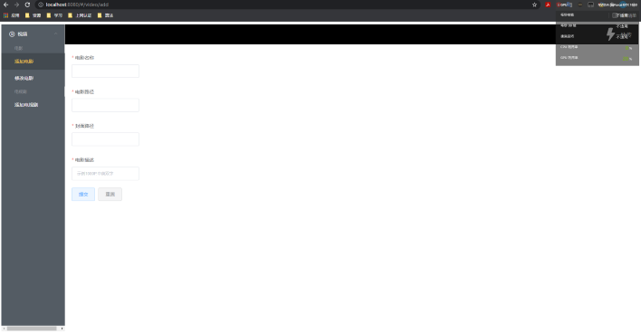
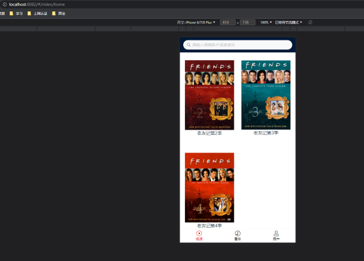
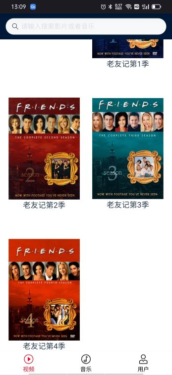

### A program can transfer video from desktop to smartphone and make user watch video on smartphone

### front end
* desktop: use element-ui,program is as follows:
  
* mobile: use vant ui,program is as follows:
### back end
* use springboot and j2 database
  
  

